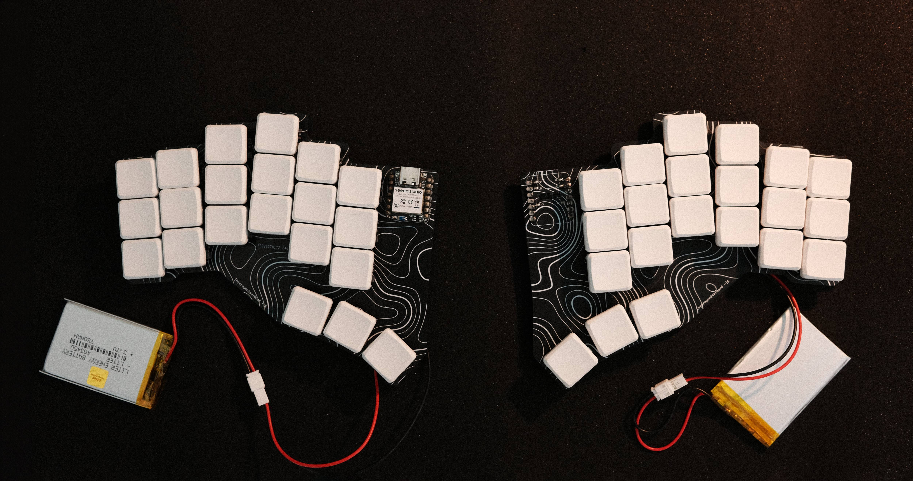
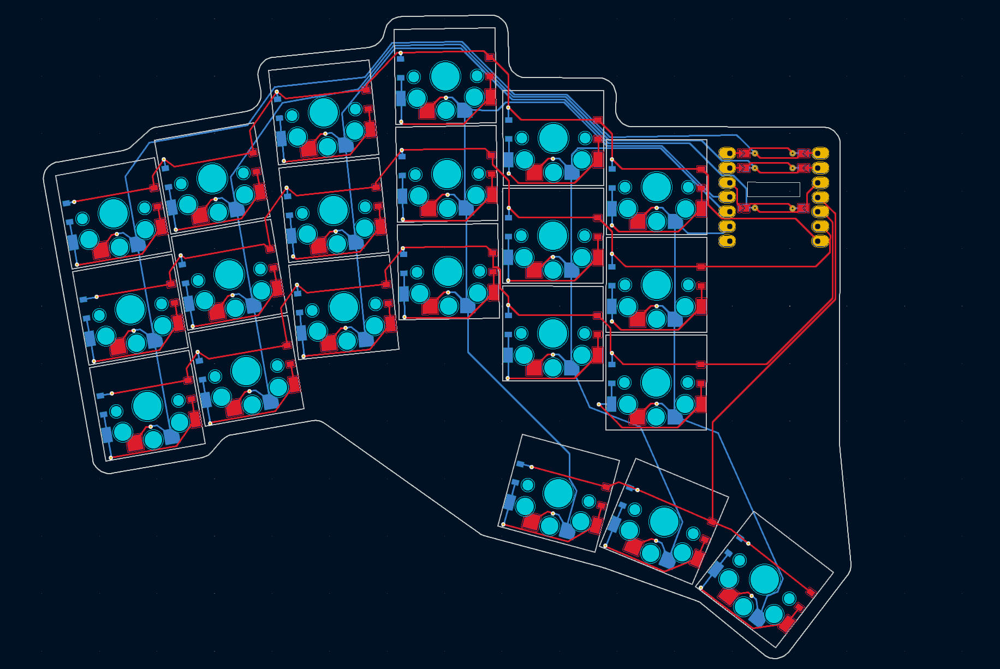

# SOR Hydrogen Keyboard
The Hydrogen is my first custom mechanical keyboard, heavily inspired by the [Corne](https://github.com/foostan/crkbd?tab=readme-ov-file). It is a thin, split, wireless ergonomic board designed specifically to match the stagger and splay of my fingers. The Hydrogen uses hotswappable Kalih Choc V2 switches, designed for use with low profile keycaps, and is based on the Seeed Xiao nRF52840 dev board. It can be used either via a USB-C (also used for charging) or a Bluetooth connection (which requires a LiPo battery for each half).

# Images

